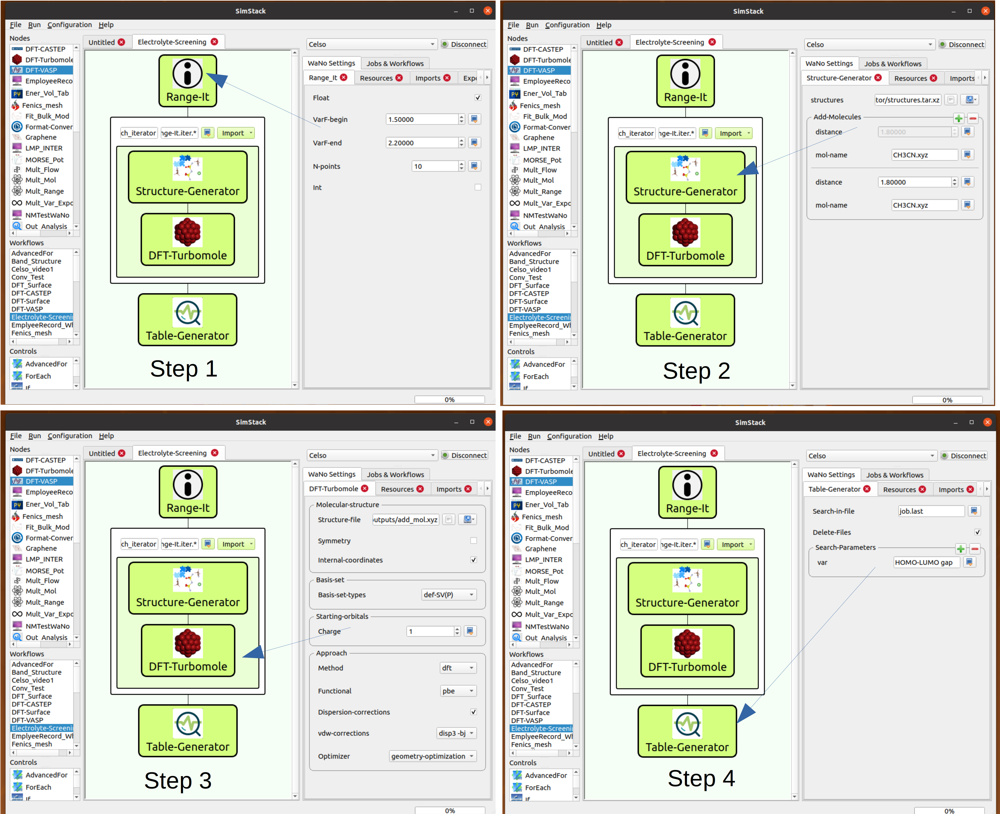

# Electrolyte-Screening

In this workflow, we use the SimStack framework features to screening electrolytes systems using DFT calculation. Here, we combine four different **WaNos**: Range-It, Structure-Generator, DFT-Turbomole, and Table-Generator, to set up an electrolyte system, load the file structure, and choose the methods embedded in the DFT approach using Turbomole code. A table containing the system's `HOMO-LUMO` gap energy and molecule label is the expected output of this protocol.

Using the drag-and-drop environment of Simstack, we can build the workflow depicted in **Fig 1** in four steps. The Range-It WaNo accounts for the number of different configurations of a given system.  In the second step, we add the Structure-Generator **WaNo** inside the ForEach loop control to generate the ```.xyz``` files of the configuration system. In the third step, we insert the DFT-Turbomole **WaNo**, which will receive the generated files from the previous one. At this step, We can take advantage of the parallelization in the HPC remote resources once the ForEach loop control is designed for this end.  Table-Generator **WaNo** extracts two variable values on the ```job.last``` file: the output file of steps two and three. This **WaNo** builds a table named Table_var in CSV format at the end of the protocol.

### In this workflow, we will be able to:
```
1. To set up many electrolyte configurations from an initial seed (Range-It).
2. Load a molecule seed and attach many other molecules to the seed (Structure-Generator).
3. Run the geometric DFT calculations using Turbomole code, accounting for the proper corrections (DFT-Turbomole).
4. Arrange all the HOMO-LUMO gap energy values of the system in a table format (Table-Generator).
```

## DFT_Surface workflow with **_ForEach_** loop control


**Fig 1** _This workflow aims to perform several DFT calculations of electrolyte systems. It comprises Range-It, Structure-Generator, DFT-Turbomole, and Table-Generator WaNos connected by the ForEach loop control. In step 1, we generate the number of configurations. Steps 2 and 3 define the electrolyte designs and the DFT calculation methods employed in the simulation. The **WaNo** in the last step extracts the inquired variables of the output file from the previous actions._

aqui

## 1. Python Setup
To get this workflow up running on your available computational resources, make sure to have the below libraries installed on Python 3.6 or newer.

```
1. Atomic Simulation Environment (ASE).
2. Python Materials Genomics (Pymatgen).
3. Numpy, os, sys, re, yaml, subprocess.
4. json, csv, shutil, tarfile 
```
## 2. Range-It Inputs
- Float and Int modes
- Range of the variable. 
- Number of points in the present in the range.
## 3. Range-It Output
- It should pass all the information to the next **WaNo** inside the ForEach loop through the ```Range-It.*``` command on the top of the loop, as **Fig 1** shows.
## 4. Structure-Generator Inputs
- Directory with the ```zip``` file of the molecules.
- Position of the attached molecule in relation to seed one.
## 5. Structure-Generator Output
- `.xyz` file, which should be passed to DFT-Turbomole **WaNo**.
- 
## 6. DFT-Turbomole Inputs
- **Molecular-structure**: Here the user can load the `.xyz` file from the previous one. **WaNo**.
- **Basis-set**: Basis set types.
- **Starting-orbitals**: charge of the system
## 7. DFT-Turbomole Output
-  ridft.out file
-  eiger.out file
-  energy file
-  job.last file
-  control (initial input file of Turbomole code)
## 8. Table-Generator Inputs
- Search_in_File: For this case, the job.last file is imported using `ForEach/*/DFT-Turbomole/outputs/job.last` command.
- Delete_Files: check the box option.
- Search-Parameters: Set the variables `Structure-label` and `HOMO-LUMO gap`.  
## 9. Table-Generator Output
- Table_var file in CSV format containing the variables defined in the Search_Parameters field.
