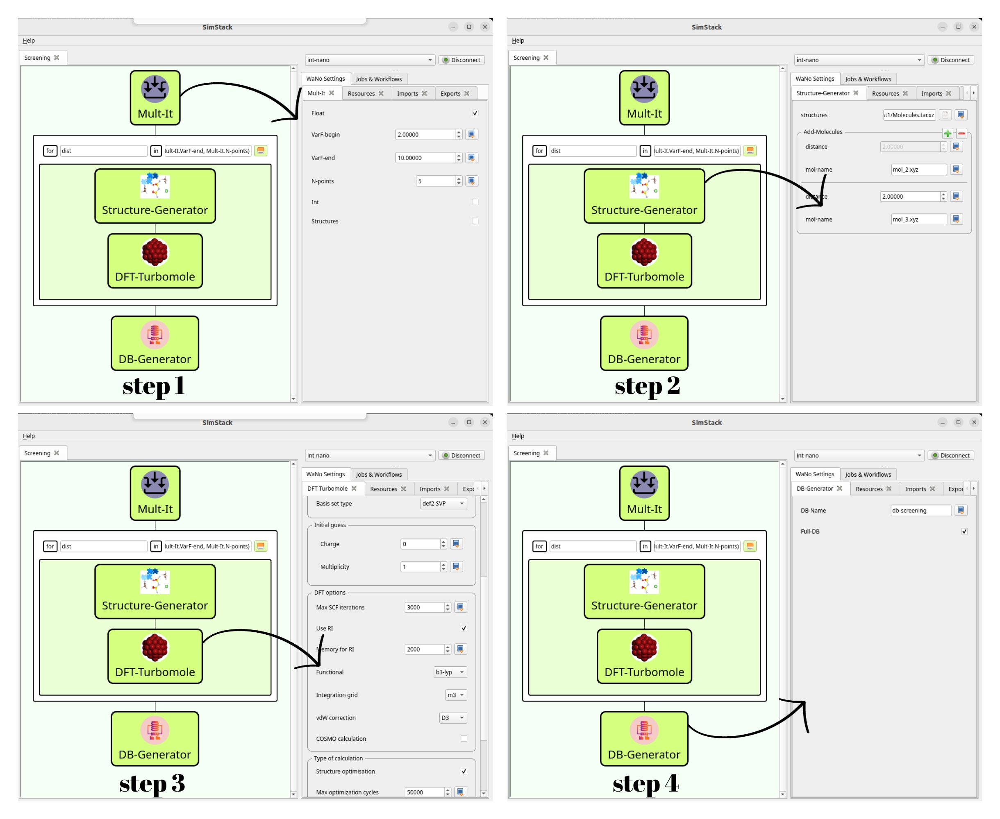

When publishing results obtained with DFT-VASP WaNo, please consider citing it.

# Electrolyte-Screening

We use the SimStack framework features to screen the best electrolyte candidates using DFT simulations. Here, we combine four different **WaNos**: Mult-It, Structure-Generator, DFT-Turbomole, and DB-Generator, to set up an electrolyte system, load the file structure, and choose the methods embedded in the DFT approach using Turbomole code. A `.yml` file containing the system's `HOMO-LUMO` gap energy and molecule label is the expected output of this protocol.

Using the drag-and-drop in SimStack's environment, we can build the workflow depicted in **Fig 1** in four steps. The Mult-It WaNo accounts for a given system's different configurations. In the second step, we add the Structure-Generator **WaNo** inside the ForEach loop control to generate the configuration system's ```.xyz``` files. In the third step, we insert the DFT-Turbomole **WaNo**, which will receive the generated files from the previous one. We can take advantage of the parallelization in the HPC remote resources at this step once the ForEach loop control is designed for this end. DB-Generator **WaNo** generates a lightweight, human-readable database in `.yml` format for all **WaNos** of a given workflow.

### In this workflow, we will be able to:
```
1. Set up electrolyte configurations from an initial seed (Mult-It).
2. Load a molecule seed and attach many other molecules to the seed (Structure-Generator).
3. Run the geometric DFT calculations using the Turbomole code, accounting for the proper corrections (DFT-Turbomole).
4. Arrange all the HOMO-LUMO gap energy values of the system in a `.yml` format (DB-Generator).
```

## Electrolyte-Screening with **_ForEach_** loop control


**Fig 1** _This workflow aims to perform several DFT calculations of electrolyte systems. It comprises Mult-It, Structure-Generator, DFT-Turbomole, and DB-Generator WaNos connected by the ForEach loop control. In step 1, we generate the number of configurations. Steps 2 and 3 define the electrolyte designs and the DFT calculation methods employed in the simulation. The **WaNo** in the last step extracts the inquired variables of the output file from the previous actions._

## 1. Python Setup
To get this workflow up and running on your available computational resources, install the below libraries on Python 3.6 or newer.

```
1. Atomic Simulation Environment (ASE).
2. Python Materials Genomics (Pymatgen).
3. Numpy, os, sys, re, yaml, subprocess.
4. json, csv, shutil, tarfile, numpy 
```
## 2. Mult-It Inputs
- Float and Int modes
- Range of the variable. 
- Number of points in the present in the range.
## 3. Mult-It Output
- It should pass all the information to the next **WaNo** inside the ForEach loop through the ```Mult-It.*``` command on the top of the loop, as **Fig 1** shows.
- Create a variable named ```dist``` in the **Advance For** loop control using numpy, e.g.;
  
```
np.linspace(Mult-It.VarF-begin, Mult-It.VarF-end, Mult-It.N-points)
```

## 4. Structure-Generator Inputs
- Directory with the ```zip``` file of the molecules.
- Position of the attached molecule about seed one.
## 5. Structure-Generator Output
- `.xyz` file should be passed to DFT-Turbomole **WaNo**.
- 
## 6. DFT-Turbomole Inputs
- **Molecular-structure**: The user can load the `.xyz` file from the previous one. **WaNo**.
- **Basis-set**: Basis set types.
- **Starting-orbitals**: charge of the system
## 7. DFT-Turbomole Output
-  ridft.out file
-  eiger.out file
-  energy file
-  job.last file
-  control (initial input file of Turbomole code)
## 8. DB-Generator Inputs
- Search_in_File: The `job.last` file is imported using `ForEach/*/DFT-Turbomole/outputs/job.last` command.
- Delete_Files: check the box option.
- Search-Parameters: Set the variables `Structure-label` and `HOMO-LUMO gap`.  
## 9. DB-Generator Output
- DB-Name(e.g., `db-screening`) file in `.yml` format containing the variables defined in the Search_Parameters field.

## Acknowledgements
This project has received funding from the European Union’s Horizon 2020 research and innovation program under grant agreement No 957189. The project is part of BATTERY 2030+, the large-scale European research initiative for inventing the sustainable batteries of the future.

## License & Copyright
  Developer: Celso Ricardo C. Rêgo, 
  Multiscale Materials Modelling and Virtual Design,
  Institute of Nanotechnology, Karlsruhe Institute of Technology
  https://www.int.kit.edu/wenzel.php

Licensed under the [KIT License](LICENSE).
